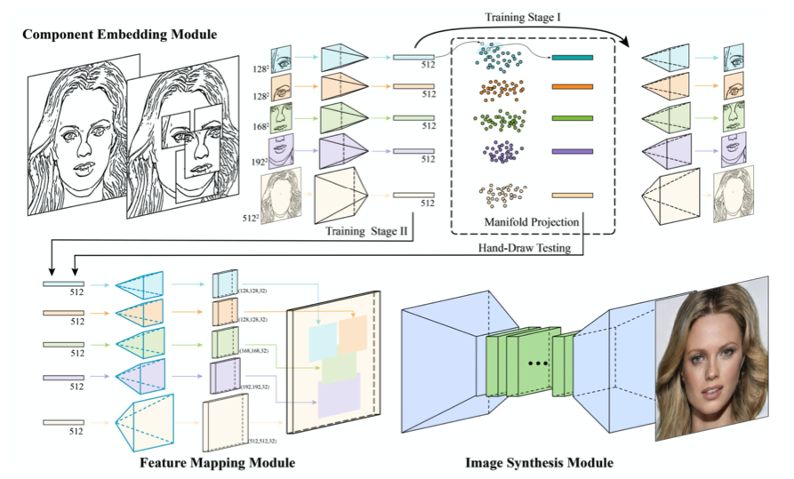
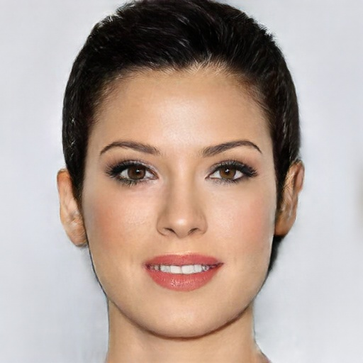
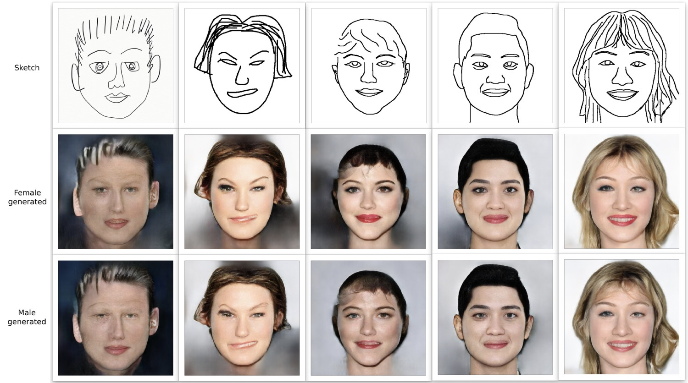

# Drawing-to-Face

***An implementation on the DeepFaceDrawing-Jittor from https://github.com/IGLICT/DeepFaceDrawing-Jittor, which generates face images from freehand sketches using the deep image-to-image translation.***


*(Teaser image from original [REPO](https://github.com/IGLICT/DeepFaceDrawing-Jittor/))*

------

## Before we start:

#### This REPO mainly helps with creating a quick working CPU environment easily using docker. If you are just looking for a quick test-drawing with the application, make sure to check out http://www.geometrylearning.com/DeepFaceDrawing/, where the original author created a web-based [testing interface](http://deepfacedrawing.geometrylearning.com/index_EN_621.html/).


## Model Architecture:



*(Illustrate of network architecture from the [paper](http://www.geometrylearning.com/paper/DeepFaceDrawing.pdf))*

#### As shown in the architecture above, the model is separated into three parts, which are Component Embedding (CE) Module, Feature Mapping (FM) Module and Image Synthesis (IS) Module. An input of hand sketch face image of size 512 by 512, is first decomposed into five components: “left-eye", “right-eye", “nose", “mouth", and “remainder". The "eye"s, "nose" and "mouth" are separated by taking window size of 128, 168 and 192, while the "remainder" is literally the remainder part of the sketch. The five components are then feature-encoded using a 5 auto-encoders with latent descriptor of 512 dimensions. The feature vectors of components are considered as the point samples of the underlying component manifolds, and are used to refine the hand-drawn sketch by projecting its individual parts to the corresponding component manifolds using K nearest neighbors, as shown in the Manifold Projection part above.

#### The individual feature vectors of components are projected to manifolds to increase its plausibility. In the FM module, instead of decoding each component vectors back to image then synthesis on the component-level, authors choosed to fuse the vectors sketches into one complete face then generate the complete image, as it helps with a more consistent result in terms of both local details and global styles. Given the combined feature vector maps, the IS module converts them to a realistic face image using a conditional GAN architecture. They also applied a two-stage training method, where in stage 1 only the five individual auto-encoders in CE module were trained using different component sketches. Then in stage 2, the parameters in stage 1 are fixed, and the FM/IS modules work together to generate face images through training GAN. 

#### For more detailed model architecture specifics, please refer to the original paper: 
[Shu-Yu Chen, Wanchao Su, Lin Gao, Shihong Xia, and Hongbo Fu. 2020. DeepFaceDrawing: deep generation of face images from sketches. ACM Trans. Graph. 39, 4, Article 72 (July 2020), 16 pages. DOI:https://doi.org/10.1145/3386569.3392386](http://www.geometrylearning.com/paper/DeepFaceDrawing.pdf)


## Getting Started

### 0. Prerequisites

- System: MacOS/Windows/Linux (Any OS that supports docker)

- RAM: 8 GB minimum, docker environment will be taking up around 6 GB

- Disk Space: 5 GB minimum

### 1. Download and install [Docker](https://docs.docker.com/get-docker/) in your operating system

### 2. Open up your terminal/CMD or any command line interface of your option
```
# Pull the docker image from Docker Hub
docker pull frank0124/drawing-to-face

# Start a container called ubuntu_env based on the pulled image
docker run -it --name ubuntu_env frank0124/drawing-to-face
```

### 3. Download pre-trained weights
```
cd /DeepFaceDrawing-Jittor/Params
wget https://www.dropbox.com/s/5s5c4zuq6jy0cgc/Combine.zip
unzip Combine.zip && rm Combine.zip
wget https://www.dropbox.com/s/cs4895ci51h8xn3/AE_whole.zip
unzip AE_whole.zip && rm AE_whole.zip
cd /DeepFaceDrawing-Jittor
```

### 4. Test run model
```
# Before test run using the included test_model.py, we need to change the cuda usage from 1 to 0 due to not setting up GPU
vim test_model.py

# Go to line 10 and change value from 1 to 0 
# Quick vim help: input i to start editing and input :wq to save progress after change
jt.flags.use_cuda = 0

# Test run
python3.7 test_model.py
```

### 5. Copy results back to your own system and view them

It is crucial to understand that after the test run or any run of the model, the generated images are saved in the running container. It would be tough to view the result .jpg files directly from docker, which requires you to set up X11 socket before running the docker. Here I recommend the simple "copy and paste" method.

Open up a new terminal/CMD on your own operating system,
```
# This line of code copies the first generated image ori0.jpg to your current directory in your OS
docker cp ubuntu_env:/DeepFaceDrawing-Jittor/ori0.jpg ./          
```

Then you can simply go to that current directory where you run your terminal/CMD, and find the pasted image. Open it just as any other pictures you have, here's the pretty face you should see.



*(ori0.jpg)*

## Next Steps

Now you know the model could run on your own environment, it's time to draw and run more tests. We will just use the test_model.py for this part, unless you want to rewrite it yourself if you have a fairly fundamental Python background. The test_model.py will take images in the /test/ directory, and we are going to replace those pictures. 

First, you want to create some 512 by 512 sized sketch jpg files. You can draw it wherever you want, on an Ipad or even on paper then take a picture of it. Then make sure it's of right format or size, I recommend Photoshop for this process for the easy size/output control. Put all the images you want to test in a directory/folder called test. 

Now, in side the docker, you want to remove the existing test images to avoid running them again.
```
# In the running container
rm /DeepFaceDrawing-Jittor/test/*
```

Lastly, open up terminal/CMD again and find the test directory that you created, which contains images you want to test.
```
# In your own OS
docker cp test ubuntu_env:/DeepFaceDrawing-Jittor/        
```
This should move all your own testing images into the container. ***We will need to change the test_model.py since it only supports less than or equal to 5 test images at once due to the pre-set component refinement parameters.*** I recommend to remove the original parameter matrix, and set the parameters yourself. There are in total 6 parameter you can set for one picture generated, for more details please refer to the "Actual Model Performance" part down below. In [example.py](example.py) that I provided in this REPO, I set all refinement parameters to 0.5 and sex to 0 (male), feel free to change at your desire. Also, I put the generated images in a /results/ directory, make sure to add that with a simple line of code to avoid errors.
```
# In the running container
mkdir /DeepFaceDrawing-Jittor/results
```

## Actual Model Performance



Let's look at the model output above. All the cases are generated with all refinement parameter set at 0.5. 

The first sketch on the left has a little bit of cartoon-ish touch on it, specifically in the bigger eyes, slightly higher eyebrows and weird looking nose. In the generated images, we can see the model struggled to put the eye and eyebrows on, in between abstract and realism. For the hair, face, mouth and ears, the model did an wonderful work in making the results as real as possible. Same goes with the second one from the left, with exaggerated eye/mouth shapes, and the model really strikes on the balance between sketch and reality.

Sketches 3 to 5 from the left are more "realism", with the comparison with first two. We also ended up with better (more realistic) generated images, closing to the quality of the teaser image in the front. However, one can still argue that the differences between male and female are minimal.


This model output above, is based on the 5th sketch above, where sex is set at female. We did a full transformation of all refinement parameter set from 0 to 1. As stated in [paper](http://www.geometrylearning.com/paper/DeepFaceDrawing.pdf), 
> 𝑤𝑏𝑐 = 1 (refinement parameter) means a full use of an input sketch for image synthesis, while by setting 𝑤𝑏𝑐 = 0 we fully trust the data for interpolation. This blending feature is particularly useful for creating faces that are very different from any existing samples or their blending.

We can see that the sketched hairstyle (with bangs) isn't available from existing samples or their blending, but by setting the parameter at 0.5, we are halfway bwtween faithful and realistic, which enables us to get a sketch-like realistic output.


